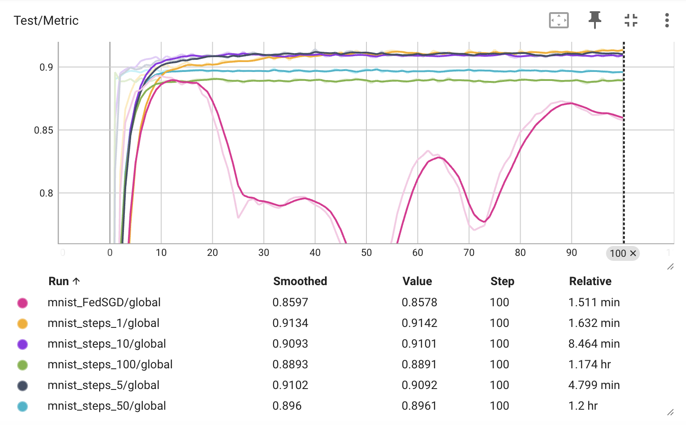
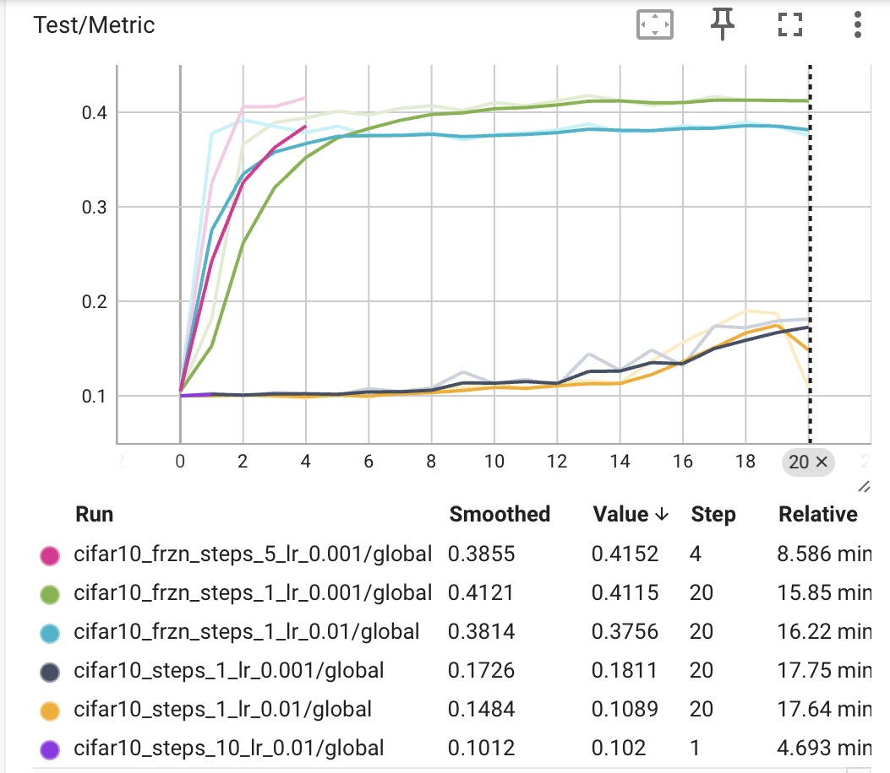

# First Lab Report

**Author:** Zeev Weizmann  
**Date:** October 2025

---

## Introduction

In this lab, we studied the basics of federated learning and the FedAvg algorithm.  
The goal was to implement local training on clients, model aggregation, and analyze the effect of local epochs.

---

## Exercise 1: UML Diagram

The first exercise required analyzing the provided codebase and producing a UML diagram of the classes and their relationships.  
It highlights the main components: **Train**, **Client**, **Learner**, **Aggregator**, and their interactions.

---

## Exercise 2: Completing the Code

In the second exercise, the missing parts of the implementation were completed:

- **Client** class: implemented `step()` for local training and `write_logs()` for reporting metrics.
- **Aggregator** class: completed `mix()` to aggregate models and `update_clients()` to synchronize them.
- **train.py**: finalized the training loop to perform multiple communication rounds.

This completed implementation allowed us to run experiments with FedAvg.

---

## Exercise 3: Effect of Local Epochs

### Experimental Setup

FedAvg was run on the **MNIST dataset** with different numbers of local steps:

## Exercise 2: Completing the Code

In the second exercise, the missing parts of the implementation were completed:

- **Client** class: implemented `step()` for local training and `write_logs()` for reporting metrics.
- **Aggregator** class: completed `mix()` to aggregate models and `update_clients()` to synchronize them.
- **train.py**: finalized the training loop to perform multiple communication rounds.

This completed implementation allowed us to run experiments with FedAvg.

---

## Exercise 3: Effect of Local Epochs

### Experimental Setup

FedAvg was run on the **MNIST dataset** with different numbers of local steps:
1, 5, 10, 50, 100
Additionally, we tested **FedSGD** (batch size = dataset, local steps = 1).

### Results

| Setting                      | Final Test Accuracy |
| ---------------------------- | ------------------- |
| FedSGD (bz=dataset, steps=1) | 0.858               |
| Local steps = 1              | 0.914               |
| Local steps = 5              | 0.910               |
| Local steps = 10             | 0.910               |
| Local steps = 50             | 0.896               |
| Local steps = 100            | 0.889               |

### Discussion

- Accuracy is highest for **1 local step (0.914)**.
- Increasing the number of local epochs (50, 100) reduces accuracy due to overfitting on local data.
- FedSGD gives lower accuracy compared to FedAvg with 1 epoch because it sacrifices local adaptation.

Thus, a moderate number of local steps (1–10) balances local training and global performance.

---

## Bonus Exercise: Complex Dataset & Model

### Objective

To challenge ourselves by integrating a more complex dataset and model:

- Integrate **CIFAR-10** into the learning framework.
- Implement **MobileNet** using PyTorch.

### Implementation

- For MNIST, CPU training was sufficient.
- For CIFAR-10 + MobileNet, local CPU training was too slow (several hours per round).
- Initially trained from scratch with `weights=None`, but this required too many communication rounds.
- Switched to pretrained weights `MobileNet_V2_Weights.DEFAULT` → enabled efficient transfer learning.
- Experiments were run on **Google Colab (GPU)**, but strict usage limits allowed only a subset of runs.

### Training & Evaluation

Trained using **FedAvg** on CIFAR-10, tested different local steps and learning rates.

### Discussion

- Freezing the feature extractor and fine-tuning only the head gave the best performance (~40%).
- Lower learning rate (**0.001**) worked better than higher (**0.01**).
- More local steps speed up convergence but need careful tuning to avoid overfitting.

---

## Conclusion

- For **MNIST**, frequent communication (few local steps) → best convergence and accuracy.
- For **CIFAR-10 + MobileNet**, transfer learning with pretrained weights was essential.
- In complex setups, balancing local steps, learning rate, and initialization is crucial.

---

## Code

The code for this lab is available on GitHub:

- **SSH:** `git@github.com:ZeevWeizmann/fedcourse24_lab1.git`
- **HTTPS:** [https://github.com/ZeevWeizmann/fedcourse24_lab1.git](https://github.com/ZeevWeizmann/fedcourse24_lab1.git)

Repository structure:

- **TP1** → MNIST experiments (Exercises 1–3).
- **TP1_bonus** → CIFAR-10 experiments (Bonus Exercise).
- **UML diagram.png** → UML diagram of the codebase.
- **REPORT** → this report.
